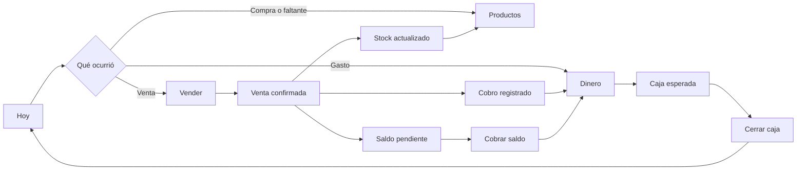

# Flujo completo de Kairós

## Qué resuelve

Kairós ayuda a registrar ventas, controlar productos y entender el dinero del negocio sin mezclar conceptos.

El recorrido principal tiene cuatro lugares:

1. **Hoy:** muestra qué pasó y cuál es el próximo paso.
2. **Vender:** registra ventas y cobros pendientes.
3. **Productos:** mantiene catálogo, precios, costos y stock.
4. **Dinero:** registra entradas, gastos y caja.

La sección **Más** contiene IA, equipo y agenda, importación, datos del negocio y configuración.

## Primer ingreso

1. Crear la cuenta.
2. Informar nombre y actividad del negocio.
3. Elegir qué ordenar primero: productos, ventas, dinero o resumen.
4. Kairós abre directamente esa tarea. No muestra un panel vacío como primer paso.

Para un negocio que vende productos, el orden recomendado es:

```text
Crear producto -> cargar costo, precio y stock -> registrar venta -> registrar cobro -> revisar Dinero -> cerrar caja
```

## Trabajo diario



### 1. Preparar productos

En **Productos** se crea cada artículo con:

- nombre y variante;
- costo;
- precio;
- stock actual;
- stock mínimo.

Este catálogo es la fuente usada por el punto de venta. El costo guardado en el producto es la fuente de verdad para calcular la ganancia.

### 2. Registrar una venta

En **Vender > Mostrador**:

1. Seleccionar productos.
2. Ajustar cantidades.
3. Elegir canal y medio de pago.
4. Informar cliente si corresponde.
5. Dejar **Importe recibido** vacío si se cobró todo, escribir un importe menor para pago parcial o `0` si quedó completamente pendiente.
6. Confirmar.

La confirmación ocurre en una única operación de base de datos:

- crea la venta;
- crea sus productos vendidos;
- obtiene el costo desde el inventario;
- descuenta stock;
- registra el movimiento de stock;
- registra únicamente el dinero cobrado;
- guarda el saldo pendiente;
- revierte todo si alguna parte falla.

### 3. Cobrar una venta pendiente

En **Vender > Historial**, una venta con saldo muestra **Cobrar**.

Al registrar el cobro:

- aumenta lo cobrado;
- reduce el saldo pendiente;
- crea una entrada en Dinero;
- no modifica el total vendido;
- no modifica la ganancia;
- no vuelve a descontar stock.

### 4. Registrar dinero

En **Dinero** se registran gastos, ingresos independientes, retiros y ajustes.

Las ventas no se suman automáticamente como dinero por su valor total. Dinero recibe solamente lo que efectivamente se cobró.

### 5. Usar caja

Para efectivo:

1. Abrir caja con saldo inicial.
2. Registrar ventas, gastos, ingresos o retiros en efectivo.
3. Revisar el efectivo esperado.
4. Contar el efectivo real.
5. Cerrar caja y revisar la diferencia.

### 6. Revisar Hoy

**Hoy** muestra solo:

- vendido este mes;
- cobrado este mes;
- pendiente de cobro;
- acciones rápidas;
- alertas operativas;
- una próxima acción recomendada.

Los reportes detallados siguen disponibles dentro de cada módulo.

## Significado de cada importe

| Concepto | Significado |
| --- | --- |
| Vendido | Precio total de las ventas confirmadas. |
| Cobrado | Dinero efectivamente recibido. |
| Pendiente | Vendido menos cobrado. |
| Costo vendido | Costo almacenado de los productos al confirmar la venta. |
| Ganancia comercial | Vendido menos costo vendido. |
| Resultado de caja | Ingresos cobrados menos egresos pagados. |
| Efectivo esperado | Saldo inicial más entradas en efectivo menos salidas en efectivo. |

Una venta no es un cobro. Cobrar después no genera una segunda venta ni una segunda ganancia.

## Funciones fuera del recorrido principal

Publicidad, contenido, métricas avanzadas, historial técnico y funciones futuras dejaron de ocupar la navegación principal. No deben competir con vender, administrar productos y controlar dinero.

La restauración de una cuenta desde JSON está desactivada hasta que pueda ejecutarse en una única transacción. La exportación permanece disponible e incluye datos operativos, caja y auditoría.
